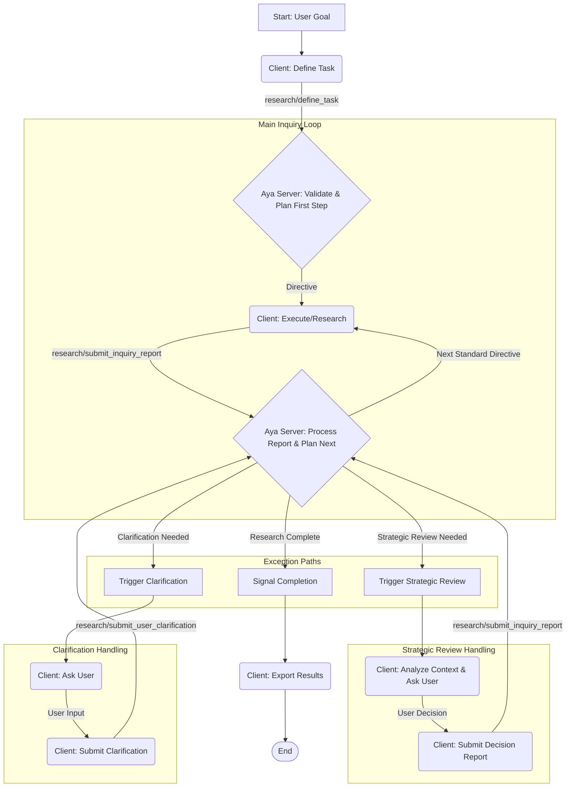

# AYA Tabular Research MCP Server

[](https://opensource.org/licenses/MIT)

<!-- Optional: Add badges for build status, coverage if CI is set up -->

## The Problem: Making AI Research Reliable 🤔

Large Language Models (LLMs) promise transformation, but turning that potential into dependable, actionable insights often feels frustratingly out of reach. Common frustrations include:

- Unpredictable research paths and results.s
- Lack of confidence in AI outputs for key decisions.
- Difficulty integrating insights into real-world workflows.

## The Solution: AYA - Orchestrated AI Research 🗺️

AYA provides the **control layer** to guide AI research effectively, acting like a GPS for your AI's research journey. It uses the **Model Context Protocol (MCP)** for structured communication and orchestration between components.

**Aya's Edge:** It combines a **reliable process engine** (the AYA Server) with the **cognitive flexibility** of an LLM (the MCP Client) via MCP.

**Control the process, leverage the intelligence.**

## How It Works: The Guided Inquiry Model

AYA employs a collaborative "Guided Inquiry" model with clear roles:

- 👤 **User:** Defines the high-level research goal and provides strategic direction or clarification when prompted by the LLM Client.
- 🤖 **LLM Client (Investigator):** Interprets the user's goal, executes tactical research steps using its capabilities (search, analysis, other MCP tools), handles strategic choices (guided by AYA & User input), and reports findings back to AYA.
  _Note: To perform research on real-world data, the LLM Client must have access to appropriate external data sources, typically configured via other MCP servers (e.g., for web crawling like Firecrawl/Crawl4AI, database access, or API interaction)._
- 🧠 **AYA Server (Director):** Manages the overall research process, maintains the knowledge base (in-memory), issues structured directives (with embedded context), triggers strategic reviews at key points, ensures consistency, and guides the LLM Client via MCP.

### Core Concepts

- **Guided Inquiry:** A collaborative, iterative process, moving beyond simple command-execution.
- **State Machine:** Research progresses through defined states (e.g., `AWAITING_TASK_DEFINITION`, `CONDUCTING_INQUIRY`, `AWAITING_USER_CLARIFICATION`, `RESEARCH_COMPLETE`). The current state and available tools can be checked via the `resource://server/status` MCP resource.
- **Embedded Context:** Directives (`InstructionObjectV3`, `StrategicReviewDirective`) carry necessary operational context directly within their payload, simplifying client logic.
- **Strategic Review:** At key inflection points (e.g., enrichment complete, critical obstacles), the AYA Server issues a `StrategicReviewDirective`. The LLM Client analyzes the provided context (potentially consulting the User) and submits a strategic decision (`FINALIZE`, `DISCOVER`, `ENRICH`, etc.) back to the server.
- **Stateless Server:** The AYA server operates statelessly within a session. All task definitions and accumulated knowledge are held in memory and are lost when the server process stops. Results must be explicitly exported by the client.

## High-Level Workflow



**Simplified Steps:**

1.  **Define:** User provides goal -> Client calls `research/define_task` with task parameters.
2.  **Direct:** Aya validates, initializes, plans, and returns the first directive (e.g., `DISCOVERY` or `ENRICHMENT`) with embedded context in the `DefineTaskResult`.
3.  **Execute:** Client receives the directive object, accesses embedded context, and performs research using its capabilities.
4.  **Report:** Client submits findings, status, obstacles, etc., in an `InquiryReport` via `research/submit_inquiry_report`.
5.  **Plan & Iterate:** Aya processes the report (validates, updates in-memory KB), plans the next step, and returns the next directive OR triggers Strategic Review OR requests Clarification OR signals Completion in the `SubmitReportAndGetDirectiveResult`.
6.  **Strategize (if triggered):** Aya sends `StrategicReviewDirective` -> Client analyzes context (may involve User) -> Client submits strategic decision in `InquiryReport` -> Aya plans accordingly.
7.  **Clarify (if needed):** Aya requests clarification -> Client involves User -> Client submits clarification via `research/submit_user_clarification` -> Aya plans accordingly.
8.  **Complete:** Aya signals completion (`status: "research_complete"`) -> Client can use `research/export_results` to retrieve the final data.

## Key Features & Benefits

- **Reliable & Verifiable Knowledge:** Builds structured, trustworthy data assets from AI research.
- **Orchestrated Process:** Effectively guides LLMs through complex research tasks via MCP.
- **Strategic Control:** Incorporates human oversight at key decision points through Strategic Reviews & Clarifications.
- **Accelerated Discovery:** Aims to reduce research time significantly compared to manual or unstructured approaches.
- **Modular & Extensible:** Clear separation of concerns (Planning, Execution, Storage). `KnowledgeBase` interface allows future backends (Graph, Vector).
- **Rich Communication:** Uses structured MCP tools and results (`DefineTaskResult`, `SubmitReportAndGetDirectiveResult`, etc.) with context embedded directly in the payload.
- **Tabular Focus (Current):** Manages structured findings primarily in an in-memory Pandas DataFrame.
- **Stateless Operation:** Ensures clean state for each research session; relies on client export for persistence.

## Use Cases

AYA's structured approach can be applied to various complex questions:

- **Business:** Strategy Development, R&D Analysis, Vendor Comparison, Market Research.
- **Personal:** Complex Product Choices, In-depth Learning, Trip Planning.

**If you need reliable, structured answers from AI-driven research, AYA can help orchestrate the process.**

## Getting Started

1.  **Prerequisites:**
    - Python (>=3.10, <=3.13)
    - `uv` (install via `pip install uv` or official instructions)
    - Node.js/npm/npx (optional, for MCP Inspector)
2.  **Clone the repository:**
    ```bash
    git clone git@github.com:MindsightsAI/aya-tabular-research.git
    cd aya
    ```
3.  **Create and activate a Python virtual environment:**
    ```bash
    # Example using venv
    python -m venv .venv
    source .venv/bin/activate # Linux/macOS
    # .venv\Scripts\activate # Windows
    ```
4.  **Install dependencies:**
    ```bash
    uv sync
    ```
5.  **Run the server:** Configure your MCP client (e.g., Cline, Cursor) to launch the server process. The command to execute is:

    ```bash
    uv run aya-tabular-research
    ```

    **WSL Configuration Example (if client is on Windows, code in WSL):**

    ```json
    {
      "mcpServers": {
        "aba-tabular-research": {
          "command": "wsl.exe",
          "args": [
            "bash",
            "-lic",
            "uv --directory /path/to/aya/ run aya-tabular-research" // <-- Update this WSL path!
          ],
          "disabled": false
        }
      }
    }
    ```

    **Non-WSL / Native Configuration Example:**

    ```json
    {
      "mcpServers": {
        "aba-tabular-research": {
          "command": "uv", // Or full path to uv
          "args": ["run", "aya-tabular-research"],
          "cwd": "/path/to/aya/", // Set if running client from elsewhere
          "disabled": false
        }
      }
    }
    ```

    _(Ensure `uv` is in the PATH accessible by the client or provide the full path)._

6.  **(Development/Debugging):** Use `./run-inspector.sh` to launch the server with the MCP Inspector tool.

## Project Status & Future

- **Current:** Operational MCP server prototype implementing the Guided Inquiry model with Strategic Review and focusing on tabular data output (in-memory).
- **Next Steps:** Potential future directions include Graph Knowledge Base integration, more advanced planning strategies, and enhanced feedback mechanisms.

## Contributing

Contributions are welcome! Please read the [CONTRIBUTING.md](CONTRIBUTING.md) file for guidelines.

## License

This project is licensed under the MIT License. See the `LICENSE.md` file for details.
